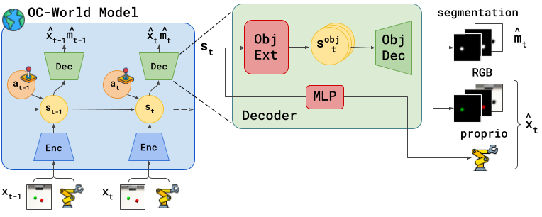

# FOCUS



This codebase was used for: 
- [1] [Focus: Object-centric world models for robotics manipulation](https://arxiv.org/pdf/2307.02427)
- [2] [Representing Positional Information in Generative World Models for Object Manipulation](https://arxiv.org/pdf/2409.12005)


## Requirements
Dockerfile is provided. Build your own docker image, in case of issues with GPU compatibility, adapt the CUDA_ARCH list. (experiments run with CUDA 12.4)

## Implemented Agents
| Exploration Agents | Command
|---|---|
| FOCUS | `agent=focus`
| Dreamer | `agent=dreamer`
| Plan2explore | `agent=plan2explore`
| APT | `agent=apt_dreamer`

| Conditioned Agents | Command
|---|---|
| Dreamer + PCP | `agent=dreamer_pcp`
| FOCUS + PCP | `agent=focus_pcp`
| FOCUS + LCP | `agent=focus_lcp`
| LEXA | `agent=lexa` 
| TD3 (model free)| `agent=td3_bc`
| IQL (model free)| `agent=iql`


## Available Environments
For the **explorative agents** we support the following environments:

| Env | Domain | Tasks |
|---|---|---|
| Robosuite | `rs` | `Lift`, `Stack` |
| ManiSkill | `ms`| `TurnFaucet`, `CustomLiftYCB` (tested with `banana` and `master_chef_can` objects)|
| MetaWorld | `mw` | `drawer-close`, `drawer-open`, `disassemble`, `handle-pull`, `peg-insert-side`| 

For the **conditioned agents** we support the following environments:

| Env | Domain | Tasks |
|---|---|---|
| Robosuite | `rs` | `Lift` (Cube move)|
| Deepmind Control Suite | `dmc`| `reacher_easy`, `reacher_hard`|
| Metaworld | `mw` | `shelf-place`, `bin-picking`|

## Instructions

Agents can be trained following both an offline or online scheme. 

In our work [1] we opted for an online training of the exploration agents followed by a finetuning stage of the task agent (sparse reward driven).

In our work [2] we adopted solely offline training for the training of conditioned agents.

For direct access to the training parameters refer to `configs/train.yaml`

### Training
To run online training run the `online_train.py` script
```sh
python online_train.py env=dmc task=reacher_easy agent=focus seed=0
```
for further finetune of the task agent:
```sh
python online_finetune.py env=dmc task=reacher_easy agent=focus seed=0 snapshot_base_dir={your_snapshot_dir} snapshot_ts={snapshot step number}
```
following this folder structure `{snapshot_base_dir} / f"snapshot_{snapshot_ts}.pt`.

If you want to train offline run:
```sh
python offline_train.py env=dmc task=reacher_easy agent=focus_lcp seed=0
```
In case of offline training, the location of the dataset needs to be provided through the argument `dataset_dir`, and must respect the following folder structure `/{dataset_dir}/{task}/{agent}/`.

**Note**: training of agent `lexa` can only be run offline, and requires to set the following flags `target_from_replay_bf` `only_obs_target` `batch_sampling`.

### Monitoring
Logs are stored in the `exp_local` folder. To launch tensorboard run:
```sh
tensorboard --logdir exp_local
```

Alternativelly wandb monitoring can be linked.

The console output is also available in a form:
```
| train | F: 6000 | S: 3000 | E: 6 | L: 1000 | R: 5.5177 | FPS: 96.7586 | T: 0:00:42
```
a training entry decodes as
```
F  : total number of environment frames
S  : total number of agent steps
E  : total number of episodes
R  : episode return
FPS: training throughput (frames per second)
T  : total training time
```